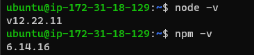

# Project 3 MERN Documentation
## Backend COnfiguration

`sudo apt update && sudo apt upgrade` 

### find node.js software on ubuntu using `curl -sL https://deb.nodesource.com/setup_12.x | sudo -E bash -`

### install node js and npm`sudo apt-get install -y nodejs`
### verify node and npm installation and version with`node -v && npm -v`

### Create Todo directory and run npm init in Todo Directory to create package.json files `mkdir Todo && cd Todo && npm init`

---
## Install Expressjs to run node.js server on 5000 port and also specify and make different directory for each task our application is going to do
### install express and create index.js file `npm install express && touch index.js`

`npm install dotenv`
`vim index.js`

### start server with `node index.js`

[server accesws with public Ip](http://54.234.189.155:5000)

## Routes for Todo Application
#Create routes directory and create a file api.js on it and also configure api.js

