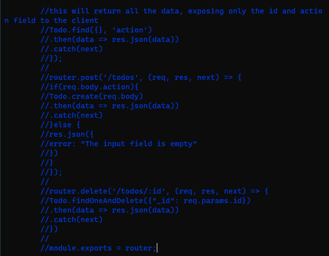
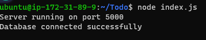
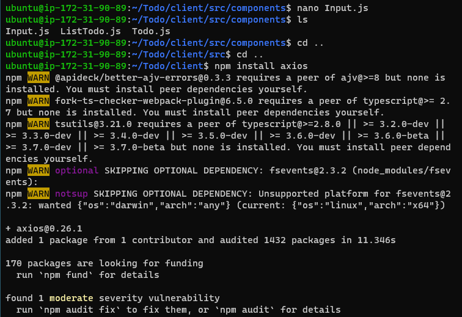

# Project 3 MERN Documentation
## Backend COnfiguration

`sudo apt update && sudo apt upgrade` 

### find node.js software on ubuntu using `curl -sL https://deb.nodesource.com/setup_12.x | sudo -E bash -`

### install node js and npm`sudo apt-get install -y nodejs`
### verify node and npm installation and version with`node -v && npm -v`

### Create Todo directory and run npm init in Todo Directory to create package.json files `mkdir Todo && cd Todo && npm init`

---
## Install Expressjs to run node.js server on 5000 port and also specify and make different directory for each task our application is going to do
### install express and create index.js file `npm install express && touch index.js`

`npm install dotenv`
`vim index.js`

### start server with `node index.js`

[server accesws with public Ip](http://54.234.189.155:5000)

## Routes for Todo Application
# Create routes directory and create a file api.js on it and also configure api.js `mkdir routes && touch api.js && vim api.js`

## Install mongoose and create new directory models to work with routes  #install mongoose`npm install mongoose`

#create new directory models, create new file todo.js and configure `mkdir models && cd models && touch todo.js`
# Update api.js files configuration on routes directory with `vim api.js`

### connecting database `node index.js`

### Install postman into your system and test all the API endpoints CRUD and make sure they are working 

# FrontEnd Creation
## Creating a user interface for a Web client broeser to interact with application Todo via API
### Create a new folder in todo called client using `npx create-react-app client`
## Installing dependies concurrently and nodemon with `npm install concurrently --save-dev && npm install nodemon --save-dev`

### edit the code in package.json file in Todo folder to use the dependencies

### configure proxy in client package.json file to let the application run on url without adding the path /api/todos/ `cd client && nano package.json`

`npm run dev` 
### cd client/src and then mkdir components and create Input.js, ListTodo.js and Todo.js
`touch Input.js ListTodo.js Todo.js`
### edit Input.js file by inserting given code, open file using `nano Input.js`

### install axios used to make request from node.js in your client directory using
`npm install axios` 
### edit a ListTodo.js file in components directory using nano

### also edit Todo.js file using nano too `nano Todo.js`

### run dev with npm in Todo directory to enable your application in http url
`npm run dev`

